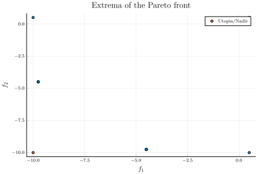
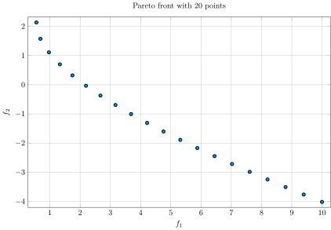

## JuMP v1.8 update

JuMP v1.8.0 added native support for multiobjective problems, so there is no longer
a need to use the `MultiJuMP.jl` extension. See the JuMP documentation for more
details: https://jump.dev/JuMP.jl/v1.8/tutorials/linear/multi_objective_knapsack/

A collection of solution algorithms is available in the MultiObjectiveAlgorithms.jl
package: https://github.com/jump-dev/MultiObjectiveAlgorithms.jl. Please open an issue
there if you have feature requests or bug reports.

# MultiJuMP

[](https://travis-ci.org/anriseth/MultiJuMP.jl)
[](https://zenodo.org/badge/latestdoi/41850916)

MultiJuMP enables the user to easily run multiobjective optimisation problems
and generate Pareto fronts. The code is built as an extension of
[JuMP](https://github.com/JuliaOpt/JuMP.jl).
We have implemented three ways to trace out the Pareto front:
- Normal Boundary Intersection (`optimize!(m, method = NBI())`)
    * This method is applicable only for nonlinear optimisation
- Weighted sums (`optimize!(m, method = WeightedSum())`)
- Constraint methods (`optimize!(m, method = EpsilonCons())`)
    * This method only works for biobjective optimisation as of now

**Disclaimer**: MultiJuMP is *not* developed or maintained by the JuMP developers.

## Installation
In Julia, call `Pkg.add("MultiJuMP")` to install MultiJuMP.

## Usage
Have a look at the tests and `examples/` directory for different use cases, including
tri-objective Pareto fronts.

MultiJuMP supports linear problems using the `linear=true` keyword when
calling `multi_model(linear=true)`. Currently, only the `EpsilonCons()`
and `WeightedSum()` methods are supported for linear problems.

```julia
using MultiJuMP, JuMP
using Clp

const mmodel = multi_model(Clp.Optimizer, linear = true)
const y = @variable(mmodel, 0 <= y <= 10.0)
const z = @variable(mmodel, 0 <= z <= 10.0)
@constraint(mmodel, y + z <= 15.0)

# objectives
const exp_obj1 = @expression(mmodel, -y +0.05 * z)
const exp_obj2 = @expression(mmodel, 0.05 * y - z)
const obj1 = SingleObjective(exp_obj1)
const obj2 = SingleObjective(exp_obj2)

# setting objectives in the data
const multim = get_multidata(mmodel)
multim.objectives = [obj1, obj2]

optimize!(mmodel, method = WeightedSum())

# Get the Utopia and Nadir points
utopiapoint = getutopia(multim)
nadirpoint = getnadir(multim)
```

Plotting  with `Plots.jl` is supported via recipes:
```julia
using Plots: plot, title!, scatter!
pltlin = plot(multim)
title!(pltlin, "Extrema of the Pareto front")

# Show Utopia and Nadir points
# (This is probably a hacky way to do this)
scatter!(pltlin,
    [utopiapoint[1], nadirpoint[1]], [utopiapoint[2], nadirpoint[2]],
    label="Utopia/Nadir")
```



As a non-linear usage example, we implement the test from
_Das and Dennis, 1998: Normal-boundary intersection: A new method for
generating the Pareto surface in nonlinear multicriteria optimization problems_:

```julia
using MultiJuMP, JuMP
using Ipopt

m = multi_model(Ipopt.Optimizer)
@variable(m, x[i=1:5])
@NLexpression(m, f1, sum(x[i]^2 for i=1:5))
@NLexpression(m, f2, 3x[1]+2x[2]-x[3]/3+0.01*(x[4]-x[5])^3)
@NLconstraint(m, x[1]+2x[2]-x[3]-0.5x[4]+x[5]==2)
@NLconstraint(m, 4x[1]-2x[2]+0.8x[3]+0.6x[4]+0.5x[5]^2 == 0)
@NLconstraint(m, sum(x[i]^2 for i=1:5) <= 10)

iv1 = [0.3, 0.5, -0.26, -0.13, 0.28] # Initial guess
obj1 = SingleObjective(f1, sense = MOI.MIN_SENSE,
                       iv = Dict{String,Any}("x[$i]" => iv1[i] for i in 1:length(iv1)))
obj2 = SingleObjective(f2, sense = MOI.MIN_SENSE)

md = get_multidata(m)
md.objectives = [obj1, obj2]
md.pointsperdim = 20
optimize!(m, method = NBI(false)) # or method = WeightedSum() or method = EpsilonCons()

# Get the Utopia and Nadir points
utopiapoint = getutopia(md)
nadirpoint = getnadir(md)

using Plots
pltnbi = plot(md)
```


